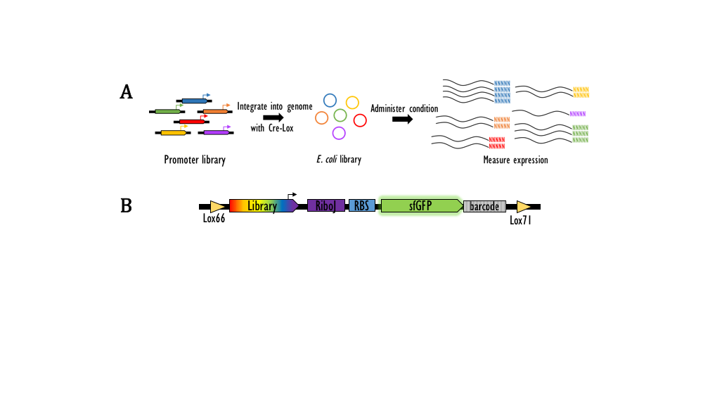

# Description of datasets #

Github repo: https://github.com/kinsigne/endo

Please do not hesitate to email me with any questions! kinsigne@ucla.edu

### Controls used in all datasets ###

- Positive controls (n = 97): short synthetic promoter sequences (~50-100bp) that span a range of expression from Sri's earlier work. Originally n = 112, sequences removed due to incompatibility with cloning restriction sites.
- Negative controls (n = 490): random 150bp genomic sequences that are least 200bp away from a TSS on either strand, on the assumption these sequences have no regulatory elements (they likely fall within genes). Originally n = 500, 10 sequences removed due to incompatibility with cloning restriction sites.

For all MPRA datasets, we clone the library upstream of a RiboJ site. It cleaves off the 5'UTR, which affects transcription rate and post-transcriptional stability of the RNA. This region can be variable in sequence content and length between promoters (especially when we include 30bp after the TSS) which has been shown to affect stability of the RNA. By cleaving it after transcription with the RiboJ, we standardize the 5' UTRs of all library variants which normalize the stability of each transcript.

Each library sequence can drive expression of sfGFP and a 20bp barcode. We map each barcode to the corresponding library sequence in an initial DNA sequencing run. Then, we use Cre-lox to integrate the construct into a landing pad on the E. coli genome, so each cell has one copy of the library at a fixed position. We can then test the library in various growth conditions, followed by RNA-sequencing of the barcodes as well as DNA-sequencing for normalization.

We calculate expression for each variant as the (sum of RNA barcodes) / (sum of DNA barcodes) for all barcodes that map to that variant. 

## Endogenous TSS library ##

This library aims to functionally validate putative TSSs from these two sources, [Storz](http://jb.asm.org/lookup/doi/10.1128/JB.02096-14) and [Wanner](https://mbio.asm.org/content/5/4/e01442-14), which together predict ~14K TSSs based on genome-wide strand-specific RNA sequencing that enriches for primary transcripts. We also included all TSSs from RegulonDB. 

TSSs can belong to multiple sources:

- Storz: n = 12,435
- Wanner: n = 1,039
- RegulonDB: n = 5,181
- Final library size: n = 18,222

For each TSS we synthesized 150bp, -120 to +30 relative to the TSS.

We tested two conditions, liquid broth (LB) rich media and minimal media (M9). I'm still standardizing the pipeline for M9, but the LB is ready to go. We recovered 96% (17533/18222) of the library after integration. The expression data lives here: `processed_data/endo_tss/lb/rLP5_Endo2_lb_expression.txt` on the github. There are two technical replicates (separate sequencing preps), and the average expression is in the column `RNA_exp_ave`.

We classified sequences into active and inactive based on the negative controls. We set the threshold at (negative control median) + 3 * (negative control standard deviation). We called 2,078 with higher expression as active and 15,455 with lower expression as inactive. Of course, these labels are only useful for downstream classification methods and not needed for regression methods.

## Endo TSS scramble library ##

The purpose of this library is to determine which motifs in the active sequences from the endogenous TSS library are driving expression. We took the active promoters and scrambled 10bp regions at 5bp intervals. Including the positive and negative controls, final library size n = 62,322. After integration, we recovered 87% (54051/62322) of the library. The expression data lives here: `processed_data/endo_scramble/endo_scramble_expression.txt`

## Genome fragmentation library ##

Next, we tested the entire genome for function. We sheared the *E. coli* genome into fragments and cloned them into our reporter construct to see which ones can drive expression. We assayed 321,057 fragments. We tested the library in both LB and M9. M9 still needs to be processed, but LB is ready to go.

Distribution of fragment length:

- min: 48
- 1st quartile: 220
- median: 244
- mean: 244.2
- 3rd quartile: 271.0
- max: 499

The data lives here: `processed_data/frag_peak_calling/U00096.2_frag-rLP5_LB_expression.txt`

## Peak tiling library ##

In our genome fragmentation library, we defined contiguous stretches of the genome that were above a certain empirically/arbitrarily chosen cutoff of expression 1.1 - this cutoff covered the majority of active TSS from the endo library. We called "peaks" with a basic algorithm which required a minimum size of 60bp and merged adjacent peaks within 40bp. We used these defined "active" peaks and generated a peak tiling library. We tiled the peaks with tiles of length 150bp, in 10bp increments. There were 3,480 active peaks. Additionally, we included 1000 randomly generated 150bp sequences. Total library size, with controls, n = 49,991. After integration, 86% (43449/49991) of the library was recovered.

The data lives here: `processed_data/peak_tile/peak_tile_expression.txt`

